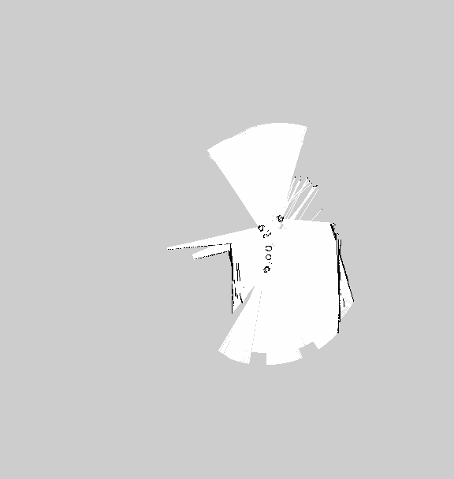

# navigation_demo

睿思学院ROS入门课程 导航演示功能包

### 运行方法

确认`robot_sim_demo`已被编译, 执行以下命令启动仿真环境:
```sh
$ source ~/catkin_ws/devel/setup.bash
$ roslaunch robot_sim_demo robot_spawn.launch
```

### 注意事项
如果你是用的是VMware虚拟机，运行Gazebo可能会出现`vmw_ioctl_command`错误，解决办法：
```sh
$ export SVGA_VGPU10=0
```
也可以将其追加到.bashrc文件中
```sh
$ echo “export SVGA_VGPU10=0” >> ~/.bashrc
```


如果gazebo出现错误，比如无法查看摄像头换面，你需要升级gazebo到gazebo7及以上版本:
```sh
$ sudo sh -c 'echo "deb http://packages.osrfoundation.org/gazebo/ubuntu-stable `lsb_release -cs` main" > /etc/apt/sources.list.d/gazebo-stable.list'
$ wget http://packages.osrfoundation.org/gazebo.key -O - | sudo apt-key add -
$ sudo apt-get update
$ sudo apt-get install gazebo7
```

**导航演示工具包的运行：**

首先运行gazebo仿真场景

	roslaunch robot_sim_demo robot_spawn.launch

然后运行键盘控制程序

	rosrun robot_sim_demo robot_keyboard_teleop.py

再运行建图程序gmapping

	roslaunch navigation_demo gmapping_demo.launch

最后，启动rviz可视化工具，这里添加了一些必须模块，如LaserScan，Map等等

	roslaunch navigation_demo view_navigation.launch

然后用键盘控制小车运动，就能在rviz上看到地图的建立过程

**存在的问题：**

1，小车容易漂移，在建图的过程中，小车的位置有时会跳来跳去

2，小车在一个地方停留时间长一点，会出现小车轮廓样式的障碍物图

